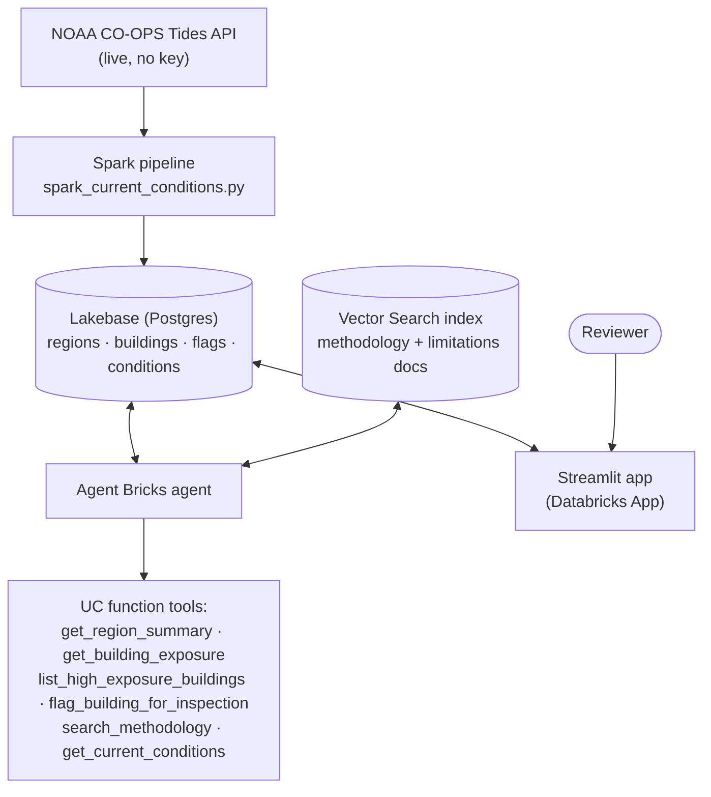
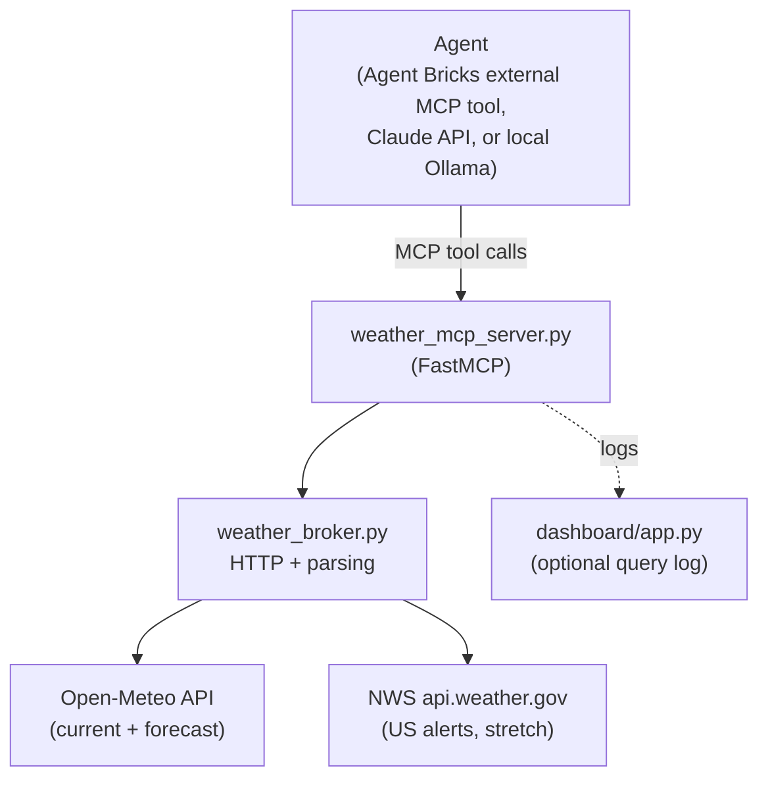
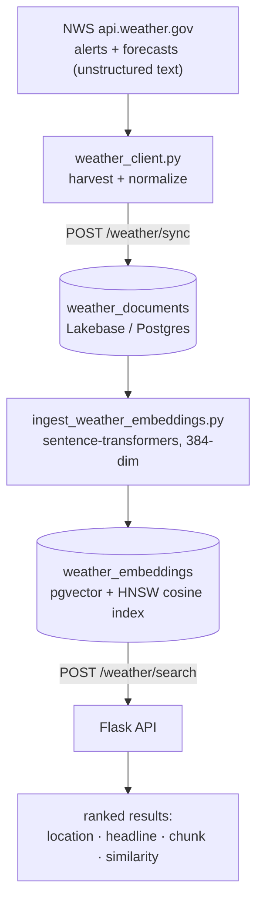
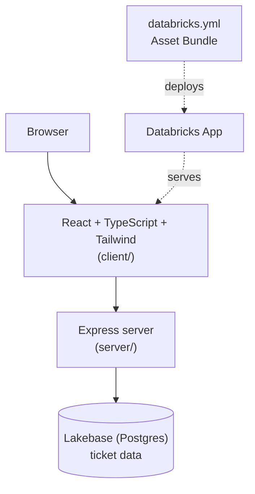

# Databricks AI Capstone

**[Live visual demo →](https://dbishal13.github.io/databricks-ai-capstone/)**

Four end-to-end projects built on the Databricks platform: agentic tools over
**Agent Bricks**, **Lakebase** (managed Postgres) as the OLTP/vector layer,
**Unity Catalog** functions, **Vector Search**, **Spark**, **MCP**, and
**Databricks Apps** for the frontend. Each project is a separate repo with
its own README, tests, and (where applicable) a live deployment; this repo
is the front door — start here, then follow the links.

> Built during and after DataExpert.io's free **Databricks AI Bootcamp**
> (see [Credits & references](#credits--references) below for the program
> and the starter repos these grew from).
> Portfolio: [DBishal13.github.io](https://dbishal13.github.io) · Contact: beesal13dh@gmail.com

## At a glance

| Project | What it is | Databricks surfaces | Links |
|---|---|---|---|
| **[Surge Exposure Advisor](https://github.com/DBishal13/surge-exposure-agent)** | Agent Bricks agent answering questions about real storm-surge exposure data for coastal buildings, with a write tool and a Streamlit review app | Agent Bricks · Unity Catalog functions · Vector Search · Lakebase · Spark · Lakehouse Federation · Databricks Apps | [Repo](https://github.com/DBishal13/surge-exposure-agent) · [Deployed app](https://surge-exposure-advisor-7474643872561377.aws.databricksapps.com) |
| **[Weather MCP Agent](https://github.com/DBishal13/weather-mcp-agent)** | A weather-forecast MCP server with judgment tools (umbrella/travel advice), driven by an external tool-use agent | Databricks Apps (`databricks` branch) · Agent Bricks external MCP tool · MCP (FastMCP) | [Repo](https://github.com/DBishal13/weather-mcp-agent) · [Databricks deployment branch](https://github.com/DBishal13/weather-mcp-agent/tree/databricks) |
| **[Weather Lakebase App](https://github.com/DBishal13/weather-lakebase-app)** | Unstructured NWS alerts/forecasts chunked, embedded, and served through semantic search | Lakebase (Postgres + pgvector) · sentence-transformer embeddings · HNSW vector index | [Repo](https://github.com/DBishal13/weather-lakebase-app) |
| **[Ticketing Service](https://github.com/DBishal13/ticketing-service)** | AI-assisted support-ticketing app: React/TypeScript frontend, Express backend, deployed as a Databricks App | Databricks Apps (AppKit) · Lakebase · Databricks Asset Bundles | [Repo](https://github.com/DBishal13/ticketing-service) · [Deployed app](https://ticketing-service-7474643872561377.aws.databricksapps.com) |

Deployed-app links require Databricks workspace SSO (by design — these
aren't public-internet apps); the repos are the thing to read. `EVIDENCE.md`
in `surge-exposure-agent` has CLI/SQL proof each app is actually running,
not just committed.

## Skills demonstrated

| | Surge Exposure Advisor | Weather MCP Agent | Weather Lakebase App | Ticketing Service |
|---|:---:|:---:|:---:|:---:|
| Agent Bricks | ✅ | ✅ | | |
| Unity Catalog functions (tools) | ✅ | | | |
| Vector Search | ✅ | | | |
| Lakebase (Postgres) | ✅ | | ✅ | ✅ |
| pgvector / semantic search | | | ✅ | |
| Spark pipeline | ✅ | | | |
| Lakehouse Federation | ✅ | | | |
| MCP server | | ✅ | | |
| Databricks Apps | ✅ | ✅ | | ✅ |
| Databricks Asset Bundles | | | | ✅ |
| Third-party live API integration | ✅ NOAA CO-OPS | ✅ Open-Meteo, NWS | ✅ NWS | |
| Automated tests | | ✅ | | ✅ |
| CI (GitHub Actions) | | ✅ | | |

## Project deep-dives

### 1. Surge Exposure Advisor

Agent Bricks agent over real storm-surge exposure data for 7,717 coastal
buildings across 8 regions — sourced from my own
[surge-exposure](https://github.com/DBishal13/surge-exposure) pipeline
(NOAA storm-surge risk layers + Overture Maps building footprints). The
agent doesn't just read data: it takes a real write action (flagging a
building for inspection) and can explain, from a real validation study, how
much to trust the exposure score it just quoted — including the study's own
uncomfortable limitations (r=0.37/r=0.52 correlation against 48,105 real
Hurricane Ian NFIP claims, not a "validated" system).



**Standout details**
- 6 registered UC function tools (4 reads, 1 write, 1 retrieval) — the agent
  has no tool that can edit or delete a score, so it can't drift from the
  source pipeline regardless of prompting.
- `agent/eval/eval_cases.md` tests *calibration*, not just "an answer came
  back" — e.g. asserting the agent correctly refuses to call a "none" score
  in New Orleans "safe," since that city's real flood risk is riverine and
  this surge-only score doesn't model it.
- Real production lessons documented in the README: Lakehouse Federation to
  Lakebase is read-only (write tool needed direct `psycopg2` instead),
  newly-created UC tables need Deletion Vectors/Row Tracking disabled or
  Vector Search delta-sync silently stalls, `dbutils` isn't available inside
  a UC Python function's sandbox.

[Full README →](https://github.com/DBishal13/surge-exposure-agent)

### 2. Weather MCP Agent

A weather MCP server (FastMCP, streamable-HTTP) exposing not just raw
forecasts but *derived judgment* tools — "do I need an umbrella," "what
should I pack" — each returning the actual numbers and the threshold logic
behind the call, not just a verdict. Deployed as a Databricks App with a
Databricks Agent Bricks agent registered against it as an external MCP tool
(see the [`databricks` branch](https://github.com/DBishal13/weather-mcp-agent/tree/databricks));
`main` also runs the identical server against a free local Ollama model or
the Claude API, so it can be verified with zero cloud dependency.



**Real transcript** (`python demo/local_agent_ollama.py "Should I bring an
umbrella in Seattle today?"`, free local `llama3.1:8b`) — the smaller model
guessed a stale date; the tool correctly rejected it, and the agent
surfaced that instead of guessing, exactly per its guardrail system prompt:

```
[tool_call] predict_umbrella_needed({"date": "2023-12-01", "location": "Seattle"})
[tool_result] {"error": "No forecast available for 'Seattle' on '2023-12-01' (forecast window is the next 10 days)."}
[assistant] I'm having trouble getting a weather report for Seattle. Could
you please clarify or try again? I'll do my best to help once we get a
valid location and date.
```

**Standout details**
- 6 tools, all HTTP calls isolated in one broker module — the test suite
  mocks `requests.get` and needs no network, and runs on every push via
  [GitHub Actions](https://github.com/DBishal13/weather-mcp-agent/actions).
- Identical system prompt and tool contract across all three agent
  runtimes (Agent Bricks, Claude API, local Ollama) — same guardrails
  regardless of which model is driving.

[Full README →](https://github.com/DBishal13/weather-mcp-agent)

### 3. Weather Lakebase App

Turns free-text NWS alerts and forecasts ("A Flash Flood Warning means
rapid-onset flooding is imminent...") into a searchable knowledge base:
Lakebase stores the raw documents, a `sentence-transformers` model embeds
them into `pgvector`, and a small Flask API serves upsert-safe sync plus
cosine-similarity search.



**Standout details**
- Idempotent by design: alerts dedupe on NWS's own `id`; forecast periods
  (which have no persistent id from the API) use a stable hash of
  `location|forecast|period|start_time`, so re-running `/weather/sync`
  leaves row counts unchanged.
- Verified live against a real Lakebase instance: 44 documents synced (incl.
  a live Flash Flood Warning and Tornado Warning), 54 chunks embedded,
  top-ranked search results confirmed topically correct for
  flood/tornado/heat/sunny-weather queries.
- README documents known limitations candidly (redundant per-state alert
  fetches, no content-hash re-embed trigger) rather than glossing over them.

[Full README →](https://github.com/DBishal13/weather-lakebase-app)

### 4. Ticketing Service

A support-ticketing Databricks App built on [AppKit](https://www.databricks.com/devhub/docs/appkit/v0/)
— React + TypeScript + Tailwind frontend, Express backend, Lakebase as the
transactional store — deployed with Databricks Asset Bundles.



**Standout details**
- `permission: CAN_CONNECT_AND_CREATE` scoped Lakebase resource wired
  through the bundle, not a hand-managed connection string.
- Full type-check/lint/format/test toolchain (`npm run typecheck`, ESLint,
  Prettier, Vitest, Playwright) — not just a demo script.

[Full README →](https://github.com/DBishal13/ticketing-service)

## Running any of these yourself

Every repo above is self-contained with its own setup section — clone it,
follow its README. The two Lakebase-backed projects need a Databricks
workspace with a Lakebase database instance; the MCP agent's `main` branch
needs nothing but Python (or Docker) and runs entirely locally.

## Credits & references

All four projects above were built for **[DataExpert.io](https://www.dataexpert.io)'s
free [Databricks AI Bootcamp](https://learn.dataexpert.io/program/the-one-week-beginners-databricks-boot-camp-7129)**
(a 3-day curriculum: Lakebase → context engineering/Vector Search → Agent
Bricks end-to-end apps). Two of them started from the bootcamp's official
per-day starter repos and were rebuilt around a different dataset/problem;
the other two are original capstone work built on the same platform
concepts. Forked reference repos, credited here for the boilerplate they
provided:

| Reference repo (upstream) | My fork | Used as the starting point for |
|---|---|---|
| [DataExpert-io/data-engineer-handbook](https://github.com/DataExpert-io/data-engineer-handbook) | [data-engineer-handbook-BD](https://github.com/DBishal13/data-engineer-handbook-BD) | Bootcamp curriculum notes and the wider data-engineering resource list |
| [EcZachly/databricks-lakebase-app-day-1](https://github.com/EcZachly/databricks-lakebase-app-day-1) | [databricks-lakebase-app-day-1-BD](https://github.com/DBishal13/databricks-lakebase-app-day-1-BD) | Day 1 exercise: Lakebase as the data layer for a simple app |
| [EcZachly/databricks-lakebase-app-day-2](https://github.com/EcZachly/databricks-lakebase-app-day-2) | [databricks-lakebase-app-day-2-BD](https://github.com/DBishal13/databricks-lakebase-app-day-2-BD) | Day 2 exercise + the Lakebase/pgvector pattern rebuilt as **Weather Lakebase App** |
| [EcZachly/databricks-lakebase-app-day-3](https://github.com/EcZachly/databricks-lakebase-app-day-3) | [databricks-lakebase-app-day-3-BD](https://github.com/DBishal13/databricks-lakebase-app-day-3-BD) | Day 3 exercise (MCP server + Agent Bricks + dashboard) — the pattern **Weather MCP Agent** was rebuilt around |

**Surge Exposure Advisor** and **Ticketing Service** are original work built
on the bootcamp's Day 3 concepts (Agent Bricks + Unity Catalog tools) and
[Databricks AppKit](https://www.databricks.com/devhub/docs/appkit/v0/)
respectively, not derived from a specific starter repo. Surge Exposure
Advisor's underlying data pipeline is my own separate
[surge-exposure](https://github.com/DBishal13/surge-exposure) project.

## License

Each project repo carries its own license (see individual repos). This
overview repo is [MIT](LICENSE).
